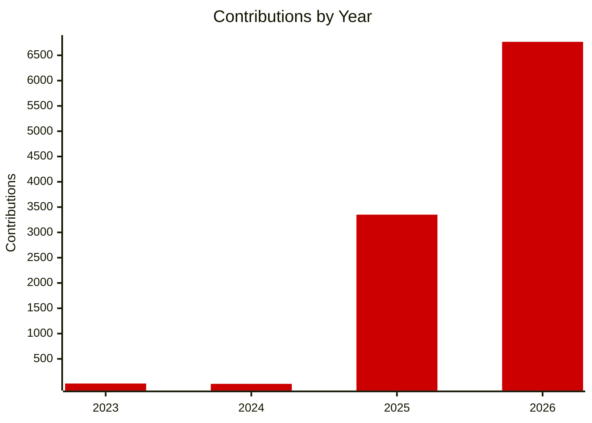
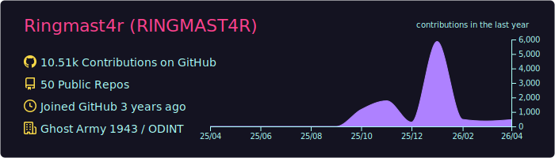
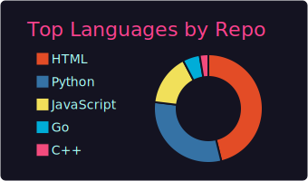
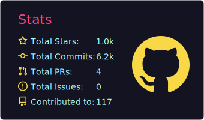
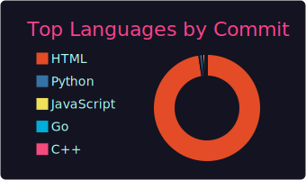
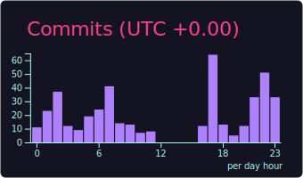
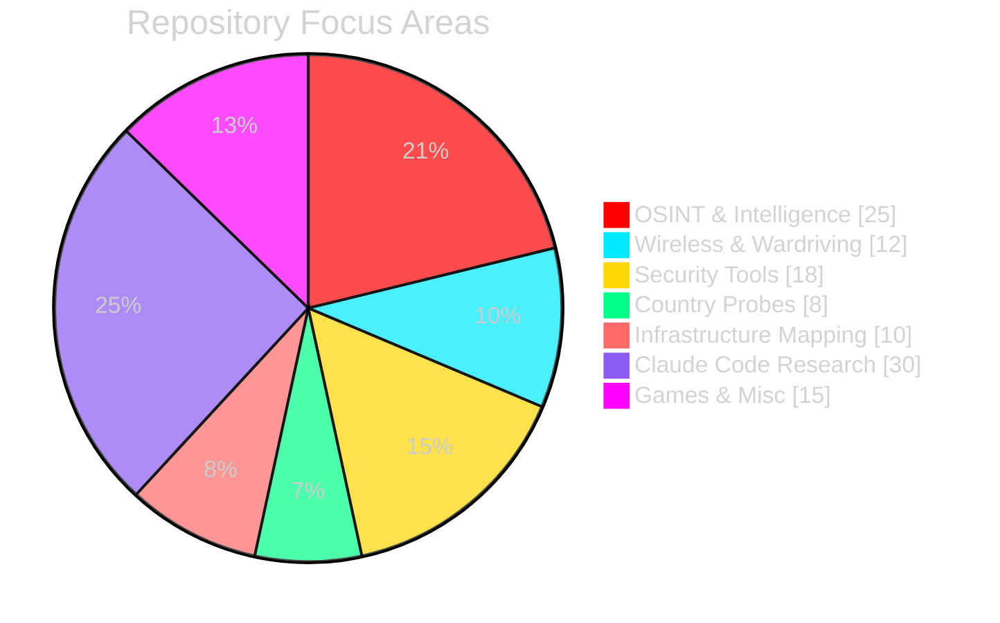

<div align="center">

[](https://git.io/typing-svg)

<br>

[](https://ringmast4r.org)
[](https://instagram.com/ringmast4r)
[](https://github.com/Ringmast4r)
[](https://youtube.com/@Ringmast4r)

</div>

---

## `> whoami`

```bash
ringmast4r@github:~$ cat profile.txt

  DESIGNATION:     Cybersecurity Researcher | Licensed Private Investigator
  EDUCATION:       Master's in Cybersecurity Management
  SPECIALIZATION:  OSINT | Wireless Security | Threat Intelligence | Incident Response
  AFFILIATION:     @GhostArmyIntel
  LOCATION:        Georgia, USA (UTC -05:00)

  STATUS:          [ ACTIVE ]
```

---

## `> wardriving_stats --wigle`

<div align="center">

| METRIC | COUNT | RANK |
|:------:|:-----:|:----:|
| **WiFi Networks Mapped** | `1,380,000+` | Top 200 Global |
| **Bluetooth Devices** | `4,300,000+` | #157 Worldwide |
| **Team Founded** | `#wardriving` | #2 Global Team |
| **Team Members** | `143+` | Growing |

</div>

<div align="center">

  [](https://wigle.net)

</div>

---


## `> neofetch --skills`

<div align="center">

<!-- LANGUAGES_START -->
### LANGUAGES


<!-- LANGUAGES_END -->

### TOOLS & PLATFORMS


### SPECIALIZATIONS


</div>

---

## `> git stats`

<div align="center">

### Contribution Growth

| YEAR | CONTRIBUTIONS | GROWTH |
|:----:|:-------------:|:------:|
| 2023 | `13` | Account created |
| 2024 | `6` | -54% |
| 2025 | `3,351` | **+55,750%** |
| 2026 | `6,767` | **+102%** *(3 months)* |
| **TOTAL** | **`10,137`** | |
| **PACE** | **~27K/yr** | **75 commits/day** |



### Activity Graph


### Streak Stats

[](https://git.io/streak-stats)

### Profile Summary









### Contribution Snake

<picture>
  <source media="(prefers-color-scheme: dark)" srcset="https://raw.githubusercontent.com/Ringmast4r/Ringmast4r/output/github-contribution-grid-snake-dark.svg" />
  <source media="(prefers-color-scheme: light)" srcset="https://raw.githubusercontent.com/Ringmast4r/Ringmast4r/output/github-contribution-grid-snake.svg" />
  
</picture>

</div>

---

## `> repo_distribution`

<div align="center">



</div>

---

## `> ls -la repos/`

<div align="center">

### All 118 Public Repositories

| Repository | Description | Stars |
|:-----------|:------------|:-----:|
| [**crystal-vault**](https://github.com/ringmast4r/crystal-vault) | Documenting Venezuela's surveillance infrastructure throu... |  |
| [**DEATH_STAR**](https://github.com/ringmast4r/DEATH_STAR) | Educational cybersecurity tool that visualizes network at... |  |
| [**FLOCK**](https://github.com/ringmast4r/FLOCK) |  Surveillance camera network map - 336K+ cameras worldwid... |  |
| [**Tower-Hunter**](https://github.com/ringmast4r/Tower-Hunter) | Cell tower logger and anomaly detector for Linux mobile d... |  |
| [**civil-engineering-cloud-claude-code-source-v2.1.88**](https://github.com/ringmast4r/civil-engineering-cloud-claude-code-source-v2.1.88) | Claude Code Source v2.1.88 源码泄露存档合集 |  |
| [**OUI-Master-Database**](https://github.com/ringmast4r/OUI-Master-Database) | The most comprehensive MAC address manufacturer lookup da... |  |
| [**GNSS**](https://github.com/ringmast4r/GNSS) | Real-time GPS satellite tracker - Educational visualizati... |  |
| [**Data-Center-Map---Global**](https://github.com/ringmast4r/Data-Center-Map---Global) |  ATLAS (All The Locations of All Servers) - Global data c... |  |
| [**Epstein**](https://github.com/ringmast4r/Epstein) | Monitoring the DOJ Epstein Files — 931,000 PDFs, 0 arrests |  |
| [**ODINT**](https://github.com/ringmast4r/ODINT) | The Observatory for Digital Infrastructure & Network Tran... |  |
| [**Ringmast4r**](https://github.com/ringmast4r/Ringmast4r) | Welcome to the Circus Motherfuckers! |  |
| [**FED**](https://github.com/ringmast4r/FED) | No description |  |
| [**MAC-SPOOFER**](https://github.com/ringmast4r/MAC-SPOOFER) |  Cross-platform MAC address spoofing tool with GUI and CL... |  |
| [**PathFinder**](https://github.com/ringmast4r/PathFinder) | PathFinder - Advanced path traversal and directory enumer... |  |
| [**Cuba**](https://github.com/ringmast4r/Cuba) | OSINT Probe into Cuba |  |
| [**surveillance-capabilities-map**](https://github.com/ringmast4r/surveillance-capabilities-map) | Interactive map of US police surveillance capabilities |  |
| [**Iran**](https://github.com/ringmast4r/Iran) |  OSINT on Iranian government infrastructure & Hezbollah m... |  |
| [**WiGLE-Vault**](https://github.com/ringmast4r/WiGLE-Vault) | Download all your WiGLE wardriving data in one command. S... |  |
| [**DEAD-MANS-TRIGGER**](https://github.com/ringmast4r/DEAD-MANS-TRIGGER) | Dead Man's Trigger - Automated safety switch that sends e... |  |
| [**wardriving-converter**](https://github.com/ringmast4r/wardriving-converter) | Universal wardriving file converter - supports 12+ format... |  |
| [**csv-merger**](https://github.com/ringmast4r/csv-merger) | Merge multiple CSV files into one mega CSV. Simple, fast,... |  |
| [**vecert-exposed**](https://github.com/ringmast4r/vecert-exposed) | OSINT investigation into VECERT Security Labs USA LLC — a... |  |
| [**claw-cli-claude-code-source-code-v2.1.88**](https://github.com/ringmast4r/claw-cli-claude-code-source-code-v2.1.88) | Claude Code v2.1.88 Source Code — actively working on a B... |  |
| [**The-Art-of-War-CLI**](https://github.com/ringmast4r/The-Art-of-War-CLI) | An interactive CLI app to read The Art of War with crimso... |  |
| [**NAZIS**](https://github.com/ringmast4r/NAZIS) | We're in the exposin' Nazis business. And cousin, busines... |  |
| [**OSINT-VISUALIZER**](https://github.com/ringmast4r/OSINT-VISUALIZER) |  Mock OSINT visualization tool demo with client-side sear... |  |
| [**Huginn-Muninn**](https://github.com/ringmast4r/Huginn-Muninn) | The ravens bring knowledge - Internet crowdsourced OSINT ... |  |
| [**higole**](https://github.com/ringmast4r/higole) | Community support resource for Higole Gole 1 Pro 5.5" Ind... |  |
| [**radio-venezuela**](https://github.com/ringmast4r/radio-venezuela) | Military & Regime Communications Intelligence — 130+ HF f... |  |
| [**Venezuela**](https://github.com/ringmast4r/Venezuela) | No description |  |
| [**PROJECT-159**](https://github.com/ringmast4r/PROJECT-159) | Biblical encyclopedia with 159 books - cross-reference an... |  |
| [**FLOCK-CSV-EXAMINER**](https://github.com/ringmast4r/FLOCK-CSV-EXAMINER) | No description |  |
| [**FORKED-SecKC-MHN-Globe--UPGRADE-EXPERIMENT**](https://github.com/ringmast4r/FORKED-SecKC-MHN-Globe--UPGRADE-EXPERIMENT) | Terminal UI visualization for SecKC Modern Honey Network ... |  |
| [**chauncygu-collection-claude-code-source-code**](https://github.com/ringmast4r/chauncygu-collection-claude-code-source-code) | A collection of the newest Claude Code open source |  |
| [**Follow-The-White-Rabbit-Game-python**](https://github.com/ringmast4r/Follow-The-White-Rabbit-Game-python) | Java-based narrative adventure combining The Matrix and A... |  |
| [**FRANKENSTEIN**](https://github.com/ringmast4r/FRANKENSTEIN) | Dual-phenomenology site checker — DNS + HTTP/S probing, 5... |  |
| [**neofetch**](https://github.com/ringmast4r/neofetch) | 🖼️  A command-line system information tool written in bas... |  |
| [**website-lists**](https://github.com/ringmast4r/website-lists) | TARGET LIST |  |
| [**Library-of-Congress-Power-Search**](https://github.com/ringmast4r/Library-of-Congress-Power-Search) | No description |  |
| [**The-Holy-Bible**](https://github.com/ringmast4r/The-Holy-Bible) | No description |  |
| [**leakix**](https://github.com/ringmast4r/leakix) | leakix is ​​a tool created by leakix.com that helps cyber... |  |
| [**Kuberwastaken-claude-code**](https://github.com/ringmast4r/Kuberwastaken-claude-code) | Claude Code's Source Code & Breakdown from a leaked map f... |  |
| [**AAYUSH412-Claude-Code-Source-Code-Analysis**](https://github.com/ringmast4r/AAYUSH412-Claude-Code-Source-Code-Analysis) | Reverse-engineered internals of Anthropic's Claude Code CLI |  |
| [**Router-Rader**](https://github.com/ringmast4r/Router-Rader) | No description |  |
| [**Follow-The-White-Rabbit-Game-JavaScript**](https://github.com/ringmast4r/Follow-The-White-Rabbit-Game-JavaScript) |  Java-based narrative adventure combining The Matrix and ... |  |
| [**APTs**](https://github.com/ringmast4r/APTs) | Advanced Persistent Threats - Adversary Emulation Referen... |  |
| [**Colombia**](https://github.com/ringmast4r/Colombia) |  OSINT intelligence on US-sanctioned Colombian President ... |  |
| [**Analyzer_forums**](https://github.com/ringmast4r/Analyzer_forums) | consumes the largest collection of forum content speciali... |  |
| [**t5-epaper-meshtastic**](https://github.com/ringmast4r/t5-epaper-meshtastic) | The official firmware for Meshtastic, an open-source, off... |  |
| [**777genius-claude-code-source-code**](https://github.com/ringmast4r/777genius-claude-code-source-code) | No description |  |
| [**i-kur-claude-code-source**](https://github.com/ringmast4r/i-kur-claude-code-source) | Claude Code Snapshot for Research. All original source co... |  |
| [**catyans-claude-code-source-analysis**](https://github.com/ringmast4r/catyans-claude-code-source-analysis) | Claude Code 泄露源码深度分析 — 基于 2026-03-31 泄露的 Anthropic Claude... |  |
| [**liz-in-tech-open-claude-code**](https://github.com/ringmast4r/liz-in-tech-open-claude-code) | Anthropic claude-code source code v2.1.88 |  |
| [**Cshaoguang-claude-code-sourcemap**](https://github.com/ringmast4r/Cshaoguang-claude-code-sourcemap) | A mirror file of the leaked source code of Claude code（20... |  |
| [**674019130-learn-real-claude-code**](https://github.com/ringmast4r/674019130-learn-real-claude-code) | Deep dive into Claude Code source — 512K lines of industr... |  |
| [**ArneshBanerjee-clawd-code**](https://github.com/ringmast4r/ArneshBanerjee-clawd-code) | Personal reference clone of instructkr/claude-code — Clau... |  |
| [**CGPS**](https://github.com/ringmast4r/CGPS) | Arduino/C++ project for color and RGB processing. Experim... |  |
| [**CTC-Game-LIVE-DEMO**](https://github.com/ringmast4r/CTC-Game-LIVE-DEMO) |  Web-based live demo of the Consider the Consequences gam... |  |
| [**Consider-The-Consequences-Game**](https://github.com/ringmast4r/Consider-The-Consequences-Game) | Interactive fiction adaptation of the 1930 book "Consider... |  |
| [**alanisme-claude-code-decompiled**](https://github.com/ringmast4r/alanisme-claude-code-decompiled) | 🔍  Deep research reports based on Claude Code source anal... |  |
| [**kurom1ii-cc-src**](https://github.com/ringmast4r/kurom1ii-cc-src) | Claude Code source |  |
| [**Intelx_CLI_Free_Version**](https://github.com/ringmast4r/Intelx_CLI_Free_Version) | This script is functional for “academic and free” users. ... |  |
| [**DarkEye**](https://github.com/ringmast4r/DarkEye) | Darkeye is a tool of Asian origin created by darkeye.org.... |  |
| [**XSS.isCTI**](https://github.com/ringmast4r/XSS.isCTI) | specialized investigative framework to investigate cases ... |  |
| [**DarkForumCTI**](https://github.com/ringmast4r/DarkForumCTI) | specialized investigative framework to investigate cases ... |  |
| [**LeakBaseCTI**](https://github.com/ringmast4r/LeakBaseCTI) | specialized investigative framework to investigate cases ... |  |
| [**Ringmast4rs-Retro-Rom-Revival**](https://github.com/ringmast4r/Ringmast4rs-Retro-Rom-Revival) | No description |  |
| [**T5S3-4.7-e-paper-PRO**](https://github.com/ringmast4r/T5S3-4.7-e-paper-PRO) | UI written for the LilyGo-EPD47-S3 project |  |
| [**nirholas-claude-code**](https://github.com/ringmast4r/nirholas-claude-code) | Claude Code is an agentic coding tool that lives in your ... |  |
| [**anthropics-claude-code**](https://github.com/ringmast4r/anthropics-claude-code) | Claude Code is an agentic coding tool that lives in your ... |  |
| [**someone114514-claude-code-source-code**](https://github.com/ringmast4r/someone114514-claude-code-source-code) | No description |  |
| [**PM-Shawn-claude-code-source**](https://github.com/ringmast4r/PM-Shawn-claude-code-source) | Claude Code v2.1.88 source restored from sourcemap + arch... |  |
| [**zoucer12-claude-code-sourcemap**](https://github.com/ringmast4r/zoucer12-claude-code-sourcemap) | No description |  |
| [**NotFoundRyan-claude-code-source**](https://github.com/ringmast4r/NotFoundRyan-claude-code-source) | Claude Code source code analysis |  |
| [**Grokci-Claude_Code_Source-full-plus-build-instructions**](https://github.com/ringmast4r/Grokci-Claude_Code_Source-full-plus-build-instructions) | No description |  |
| [**Perrilee711-claude-code-source-2026**](https://github.com/ringmast4r/Perrilee711-claude-code-source-2026) | Claude Code CLI source code (leaked 2026-03-31) - for res... |  |
| [**wangpenghui-1-claude-code-source-code**](https://github.com/ringmast4r/wangpenghui-1-claude-code-source-code) | No description |  |
| [**cmsj-Leslie-claude-code-source**](https://github.com/ringmast4r/cmsj-Leslie-claude-code-source) | 🚨 Anthropic Claude Code 终端助手泄露版全套源码。 |  |
| [**huluhaziqi-claude-code-source**](https://github.com/ringmast4r/huluhaziqi-claude-code-source) | 🚨 Anthropic Claude Code  |  |
| [**Dede98-claude-usage**](https://github.com/ringmast4r/Dede98-claude-usage) | See your Claude rate limits in real time. Single binary, ... |  |
| [**Luminous-auto-claude-code-source**](https://github.com/ringmast4r/Luminous-auto-claude-code-source) | source |  |
| [**varun-ahlawat-claude-code-src-code**](https://github.com/ringmast4r/varun-ahlawat-claude-code-src-code) | It's the leaked Claude Code source code. |  |
| [**pmkol-claude-code-source**](https://github.com/ringmast4r/pmkol-claude-code-source) | Claude-code source code in this repository is copyright A... |  |
| [**mikeOnBreeze-claude-code-source-033126**](https://github.com/ringmast4r/mikeOnBreeze-claude-code-source-033126) | No description |  |
| [**Novakevinx-claude-code-source-code**](https://github.com/ringmast4r/Novakevinx-claude-code-source-code) | No description |  |
| [**xXJSONDeruloXx-claude-code-source**](https://github.com/ringmast4r/xXJSONDeruloXx-claude-code-source) | Claude Code v2.1.88 extracted TypeScript source + working... |  |
| [**thejourneytothewestrobin-cyber-claude-code-sourcemap**](https://github.com/ringmast4r/thejourneytothewestrobin-cyber-claude-code-sourcemap) | No description |  |
| [**ohmuyi-claude-code-source-guide**](https://github.com/ringmast4r/ohmuyi-claude-code-source-guide) | 帮助读者建立稳定的源码心智模型，而不是在海量 TypeScript 文件里迷路。 |  |
| [**niuma996-claude-code-sourcemap-wiki**](https://github.com/ringmast4r/niuma996-claude-code-sourcemap-wiki) | Wiki generated based on https://github.com/ChinaSiro/clau... |  |
| [**luckdogone-claude-code-sourcemap**](https://github.com/ringmast4r/luckdogone-claude-code-sourcemap) | No description |  |
| [**gateszhangc-claude-code-source-code**](https://github.com/ringmast4r/gateszhangc-claude-code-source-code) | No description |  |
| [**elex-fu-claude-code-source**](https://github.com/ringmast4r/elex-fu-claude-code-source) | claude code  源代码分析 |  |
| [**dadiaomengmeimei-claude-code-sourcemap-learning-notebook**](https://github.com/ringmast4r/dadiaomengmeimei-claude-code-sourcemap-learning-notebook) | No description |  |
| [**beita6969-claude-code**](https://github.com/ringmast4r/beita6969-claude-code) | Claude Code Source - Buildable Research Fork. Reverse-eng... |  |
| [**WeKruit-Claude-Code-Source**](https://github.com/ringmast4r/WeKruit-Claude-Code-Source) | No description |  |
| [**TheEterna-tengu-files**](https://github.com/ringmast4r/TheEterna-tengu-files) | Claude Code Source Code Deep Analysis - The Tengu Files |  |
| [**SatoMini-claude-code-source-map**](https://github.com/ringmast4r/SatoMini-claude-code-source-map) | This repository restores the TypeScript source code from ... |  |
| [**RamaKavanan-claude-code**](https://github.com/ringmast4r/RamaKavanan-claude-code) | Claude code source code has been leaked via a map file in... |  |
| [**OrcaWhisper-Claude-Code**](https://github.com/ringmast4r/OrcaWhisper-Claude-Code) | Claude Code source archive reconstructed from the publish... |  |
| [**Liyurun-Claude-Code-Source**](https://github.com/ringmast4r/Liyurun-Claude-Code-Source) | Claude Code源码分析及解读 |  |
| [**InvictusAutomation-claude-code-leak-analysis**](https://github.com/ringmast4r/InvictusAutomation-claude-code-leak-analysis) | Claude Code source code leak analysis - Learning notes |  |
| [**GPT-AGI-Clawd-Codex**](https://github.com/ringmast4r/GPT-AGI-Clawd-Codex) | Open-source reimplementation based on Claude Code source ... |  |
| [**Franklin-Yao-anthropic-claude-code-source-code**](https://github.com/ringmast4r/Franklin-Yao-anthropic-claude-code-source-code) | No description |  |
| [**AL-MARID-claude-code-source**](https://github.com/ringmast4r/AL-MARID-claude-code-source) | No description |  |
| [**Piebald-AI-claude-code-system-prompts**](https://github.com/ringmast4r/Piebald-AI-claude-code-system-prompts) | All parts of Claude Code's system prompt, 18 builtin tool... |  |
| [**pengchengneo-Claude-Code**](https://github.com/ringmast4r/pengchengneo-Claude-Code) | 可运行的Claude Code源码 |  |
| [**oboard-claude-code-rev**](https://github.com/ringmast4r/oboard-claude-code-rev) | Runnable ClaudeCode source code |  |
| [**Yuyz0112-claude-code-reverse**](https://github.com/ringmast4r/Yuyz0112-claude-code-reverse) | A Tool to Visualize Claude Code's LLM Interactions |  |
| [**hangsman-claude-code-source**](https://github.com/ringmast4r/hangsman-claude-code-source) | claude code source map v2.1.88 |  |
| [**ChinaSiro-claude-code-sourcemap**](https://github.com/ringmast4r/ChinaSiro-claude-code-sourcemap) | No description |  |
| [**sanbuphy-claude-code-source-code**](https://github.com/ringmast4r/sanbuphy-claude-code-source-code) | Claude Code v2.1.88 Source Code |  |
| [**ghuntley-claude-code-source-code-deobfuscation**](https://github.com/ringmast4r/ghuntley-claude-code-source-code-deobfuscation) | This is a cleanroom deobfuscation of the official Claude ... |  |
| [**chatgptprojects-claude-code**](https://github.com/ringmast4r/chatgptprojects-claude-code) | YEEET!  |  |
| [**claude-code**](https://github.com/ringmast4r/claude-code) | An independent Python feature port of Claude Code, entire... |  |
| [**viewer-website**](https://github.com/ringmast4r/viewer-website) | Professional artist website for VIEWER - Drum and Bass pr... |  |
| [**kismet**](https://github.com/ringmast4r/kismet) | Github mirror of official Kismet repository |  |
| [**null**](https://github.com/ringmast4r/null) | No description |  |
| [**That-Bitch-Diella-AI-system-**](https://github.com/ringmast4r/That-Bitch-Diella-AI-system-) | Lol ~ Oh Yeah!! - Kool Aid Man |  |

</div>

---

## `> connect`

<div align="center">

```
+------------------------------------------------------------------------------+
|                                                                              |
|   "While others see empty streets, I see millions of signals waiting         |
|    to be discovered. Every BSSID has a location. Every location,             |
|    a story. I don't just drive - I wardrive."                                |
|                                                                              |
|                                               - RINGMAST4R                   |
|                                                                              |
+------------------------------------------------------------------------------+
```


</div>

---

<div align="center">

<picture>
  <source media="(prefers-color-scheme: dark)" srcset="https://raw.githubusercontent.com/Ringmast4r/Ringmast4r/output/github-contribution-grid-snake-dark.svg" />
  <source media="(prefers-color-scheme: light)" srcset="https://raw.githubusercontent.com/Ringmast4r/Ringmast4r/output/github-contribution-grid-snake.svg" />
  
</picture>

</div>


